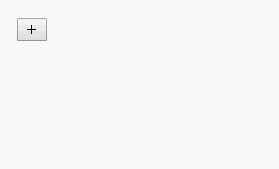

# Task
Oftentimes, when creating forms for web applications, we'd like to offer a dynamic number of input fields for the user. Controls such as adding, removing and reordering these fields can help make the experience of filling out a form or organizing a set of text items intuitive for the user.

For this challenge, you'll create a simple component DynamicInput which renders the following elements:

- `<button class="add-row">`, an always-available button to append a text field and its corresponding buttons (we'll call this a row henceforth) onto the list of visible fields.
- A list of zero or more rows of input elements and action buttons:
`<input class="row-input" />`, which offers the user a place to enter text for the n-th row.
- `<button class="row-up">`, which enables the n-th row to be moved up (if it's not already at the top of the list).
- `<button class="row-down">`, which enables the n-th row to be moved down (if it's not already at the bottom of the list).
- `<button class="row-delete">`, which enables the n-th row to be removed from the list.
The test suite relies on these class names to manipulate your component.

## Functionality Specifications
Here are the requirements you'll be implementing for the DynamicInput component. Note that focus (which element is active and ready to accept user input) is an important piece of the specification.

### Adding an input field row
Initially, the component will only offer a single button, `<button class="add-row">`, which, when clicked, will append a new input field to the list of input fields. After clicking this box, focus should be on the newly created input field so the user can begin typing right away. Along with each input field, three corresponding buttons should be created, as described above:

- `<button class="row-up">`
- `<button class="row-down">`
- `<button class="row-delete">`

### Text input
The user may enter text into any of the visible `<input class="row-input" />` elements at any time.

### Removing an input field row
Clicking the `<button class="row-delete">` button associated with an input field should completely remove that input field, along with any other associated buttons for that field. Focus will move to the input field in the row which replaced the deleted row, nowhere if there are no fields left, or on the new last row if the last row was deleted.

### Moving a field row up
Clicking the `<button class="row-up">` button associated with an input field should move that input field one position up in the list (or forward; closer to the beginning of the list). Focus should be placed on the newly moved field after this operation, and all associated buttons should move alongside the element. If a field is already at the top of a list, no reordering should occur, but focus should be transferred to the topmost field nonetheless.

### Moving a field row down
Clicking the `<button class="row-down">` button associated with an input field should move that input field one position down in the list (or backward; closer to the end of the list). Focus should be placed on the newly moved field after this operation, and all associated buttons should move alongside the element. If a field is already at the bottom of a list, no reordering should occur, but focus should be transferred to the bottommost field nonetheless.

### Style
Your style and CSS need not be complex. While there is no predetermined correct solution from a stylistic standpoint and logical functionaliy is foremost, please take the time to build a simple interface that offers a reasonable user experience.

---
# Demo
This demo shows the finished app in action. Note the behavior of focus after each button operation.

---

